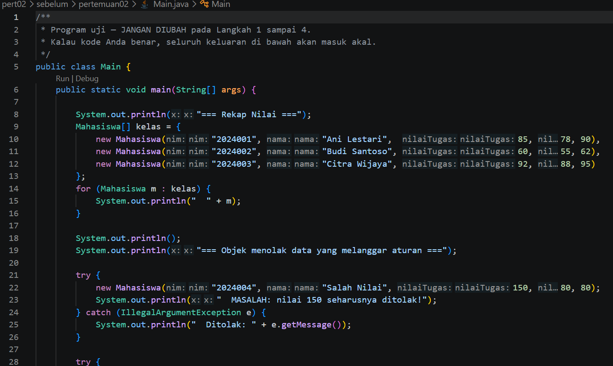
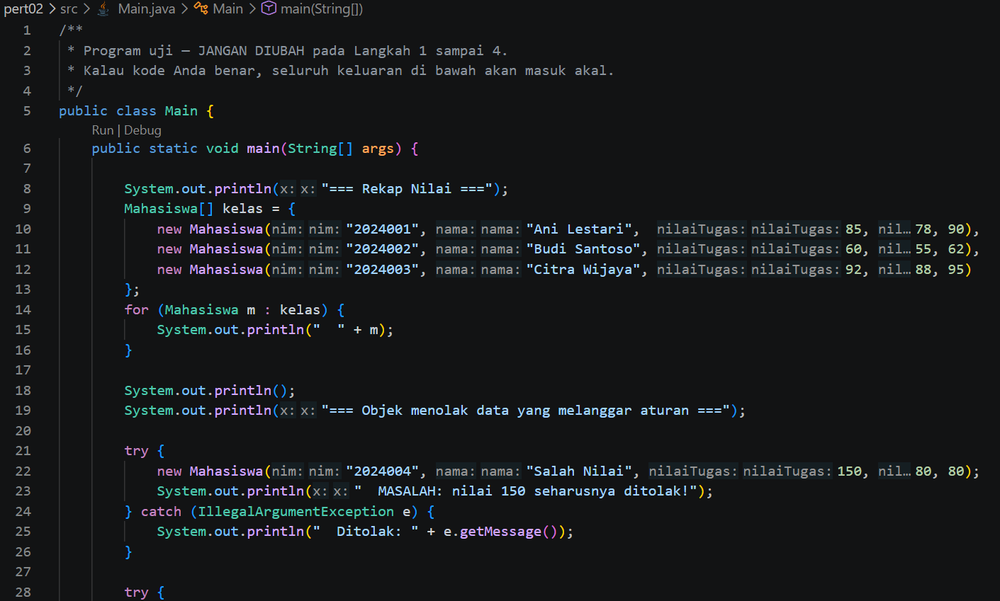
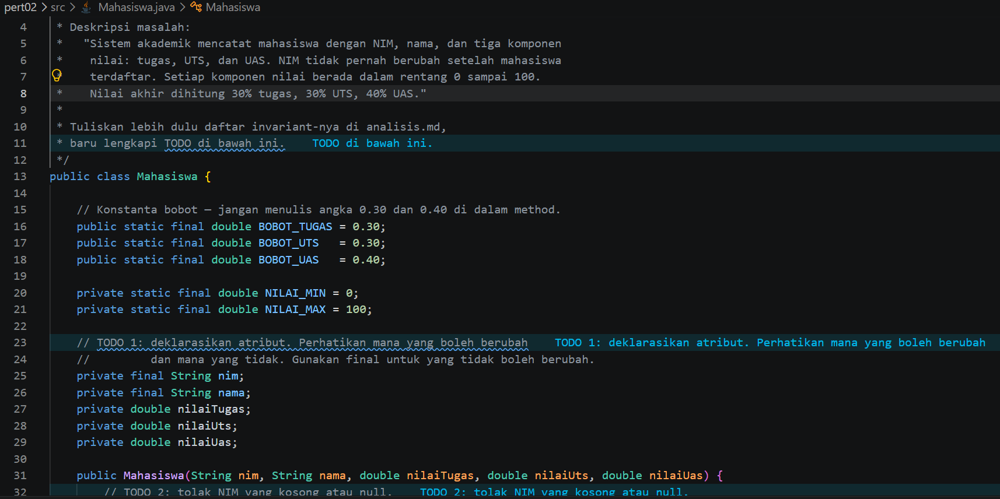
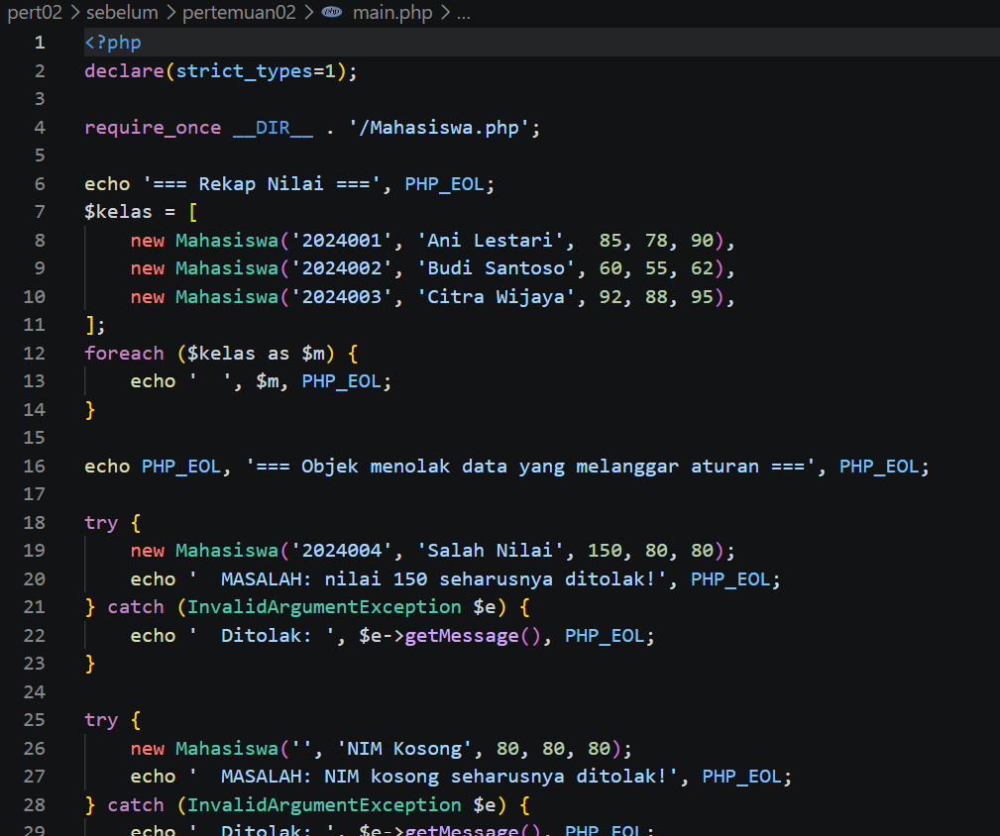
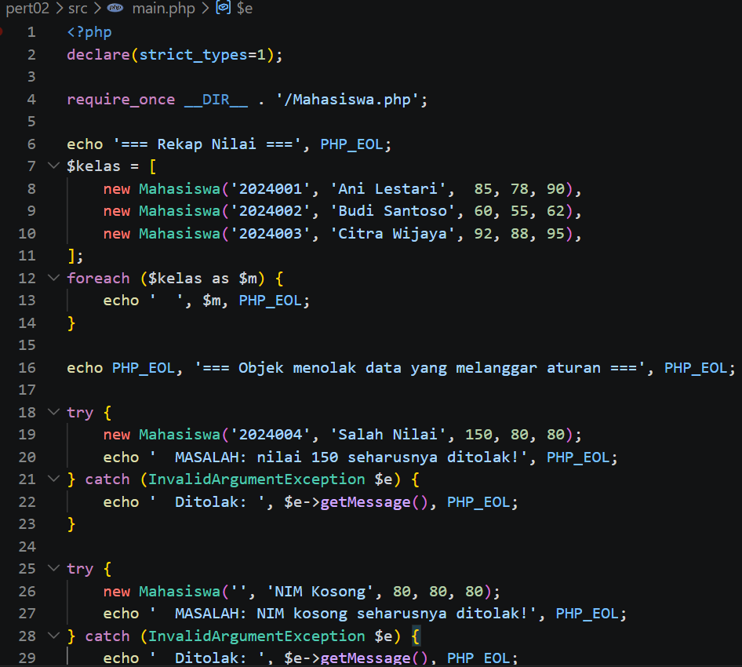
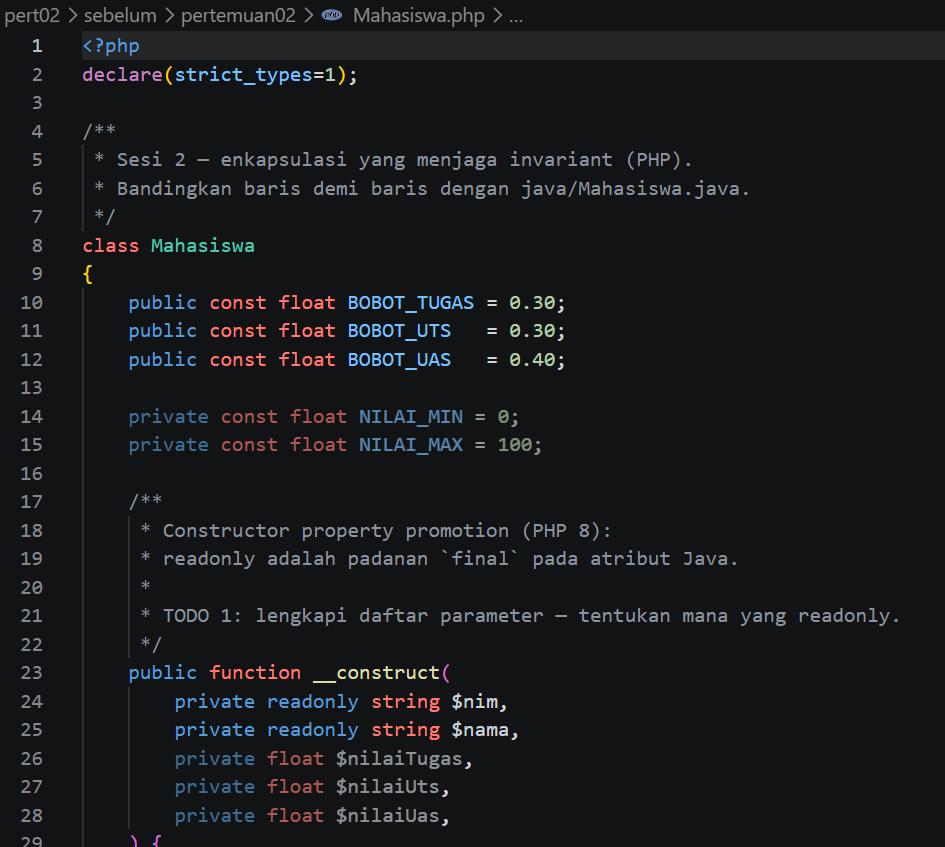
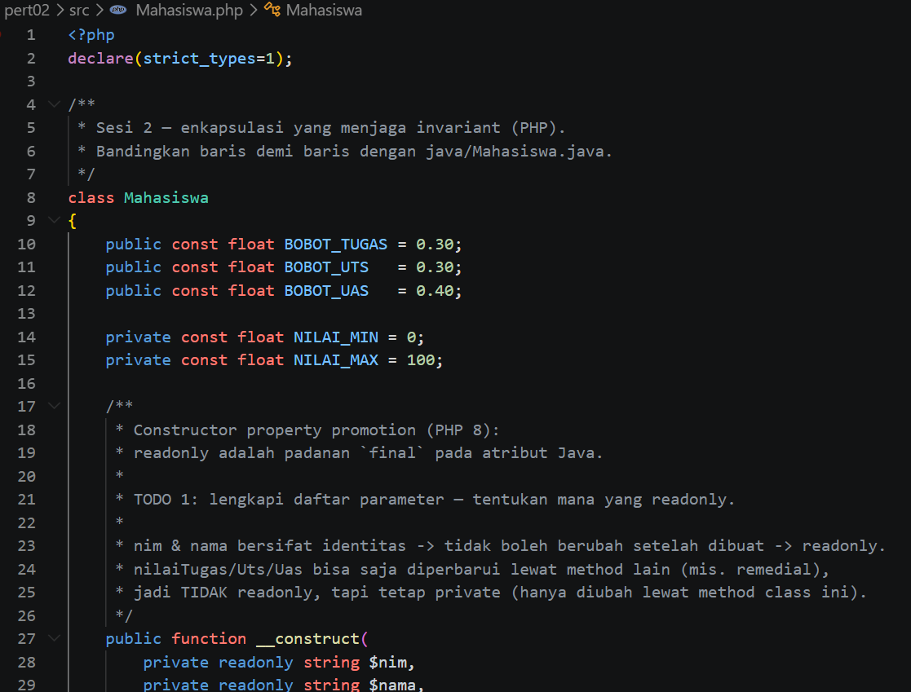
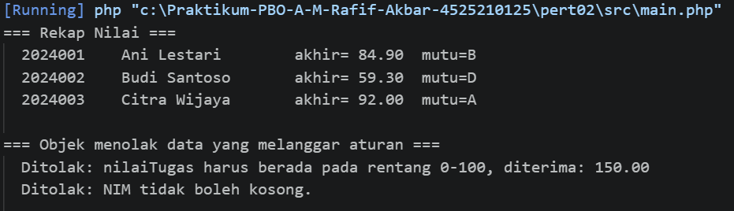

# LAPORAN PRAKTIKUM PEMROGRAMAN BERBASIS OBJEK

| Informasi Praktikan | Keterangan |
| :--- | :--- |
| **Nama** | Muhammad Rafif Akbar |
| **NPM** | 4525210125 |
| **Kelas** | A |
| **Mata Kuliah** | Pemrograman Berbasis Objek (PBO) |
| **Pertemuan** | 02 - Kelas, Objek, dan Enkapsulasi |
| **Tanggal** | Kamis 10 September 2026 |

---

## 1. Implementasi Java

### 1.1. File: `Main.java`

**Penjelasan Kode:**
> Program utama yang membuat beberapa objek Mahasiswa, menampilkan rekap nilai, dan menguji penolakan data yang tidak valid.

**Bukti Eksekusi (Screenshot):**
- **Before** 
- **After** 

### 1.2. File: `Mahasiswa.java`

**Penjelasan Kode:**
> Merepresentasikan data mahasiswa. Atribut NIM dan nama dibuat tetap, sedangkan nilai tugas, UTS, dan UAS divalidasi agar berada pada rentang 0–100. Nilai akhir dihitung dengan bobot tugas 30%, UTS 30%, dan UAS 40%; kelas juga menyediakan representasi teks mahasiswa.

**Bukti Eksekusi (Screenshot):**
- **Before** 
- **After** 

### Output

**Output Program:**

---

## 2. Implementasi PHP

### 2.1. File: `main.php`

**Penjelasan Kode:**
> Program utama PHP yang berisi kelas Mahasiswa, membuat data mahasiswa, menampilkan rekap, dan mengambil untuk NIM kosong.

**Bukti Eksekusi (Screenshot):**
- **Before** 
- **After** 

### 2.2. File: `Mahasiswa.php`

**Penjelasan Kode:**
> Implementasi kelas Mahasiswa dalam PHP dengan tipe data, validasi nilai, perhitungan nilai akhir, dan huruf mutu.

**Bukti Eksekusi (Screenshot):**
- **Before** 
- **After** 

### Output

**Output Program:**

---

## 3. Kesimpulan

Enkapsulasi membatasi akses langsung ke atribut dan menjaga aturan data. Konstruktor memvalidasi data dari awal objek dibuat, sedangkan konstanta bobot mencegah angka bobot tersebar di berbagai method.
