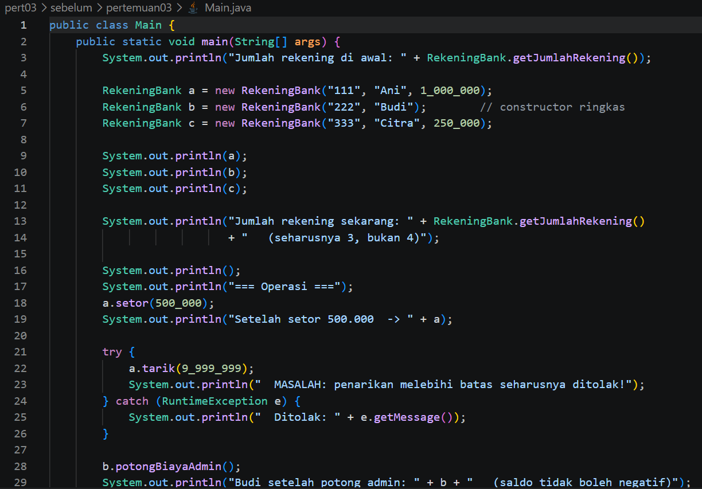
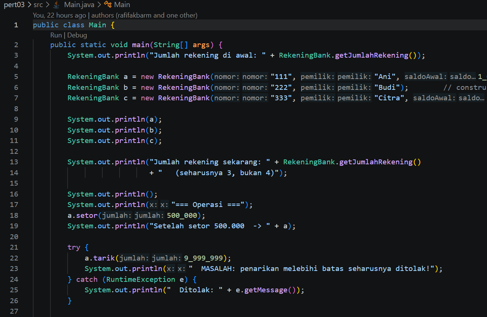
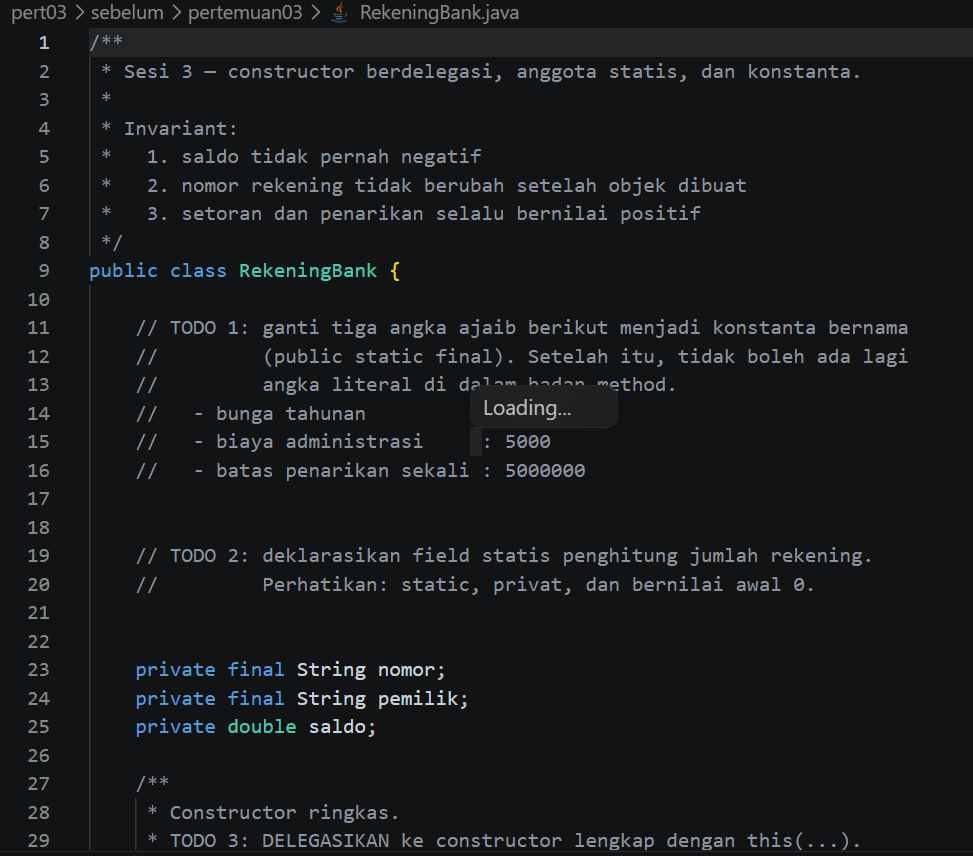
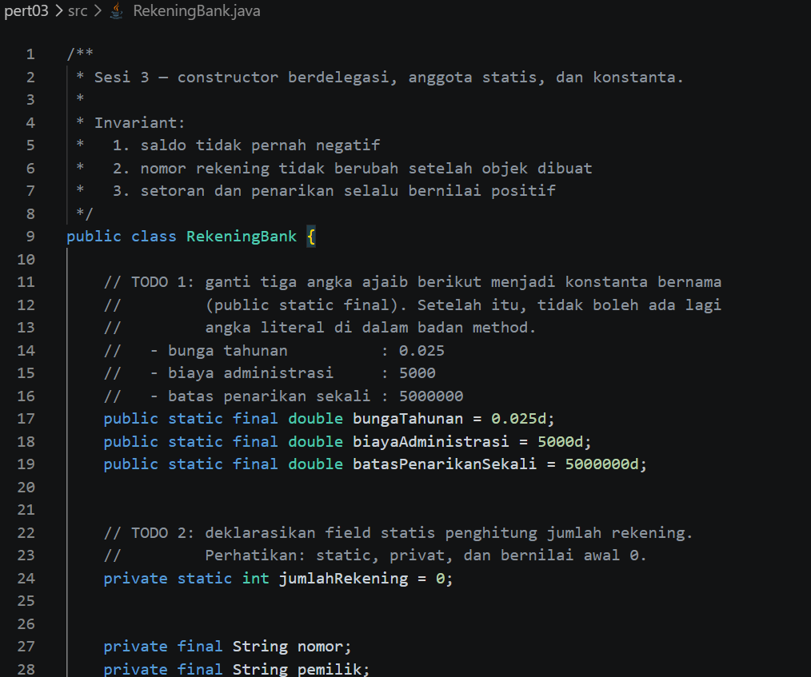
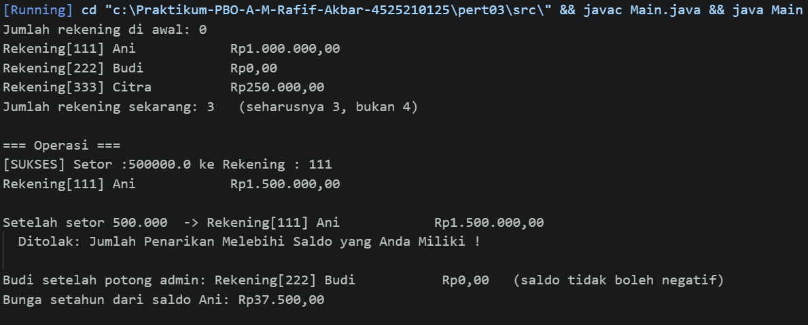
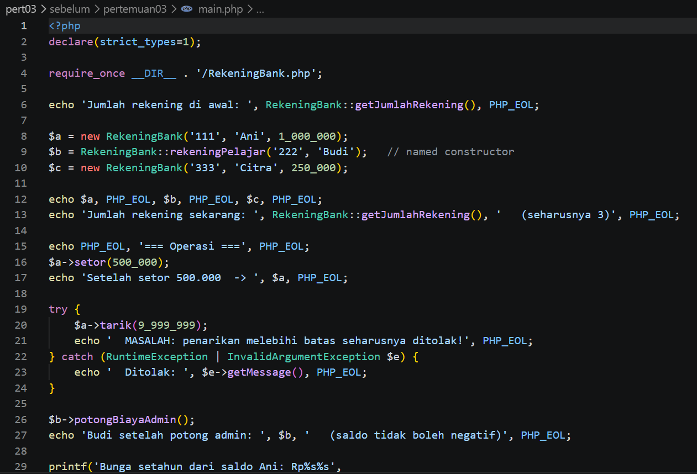
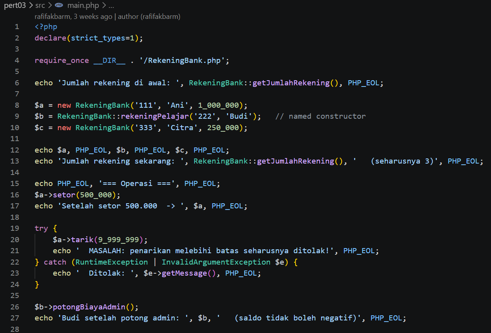
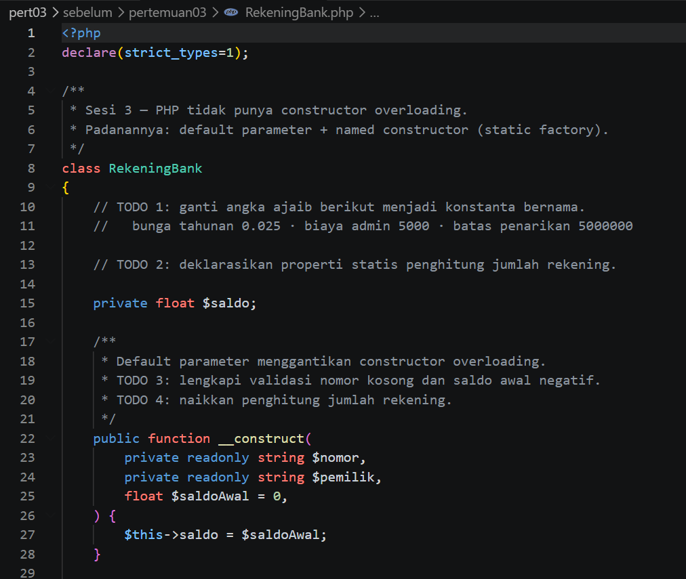
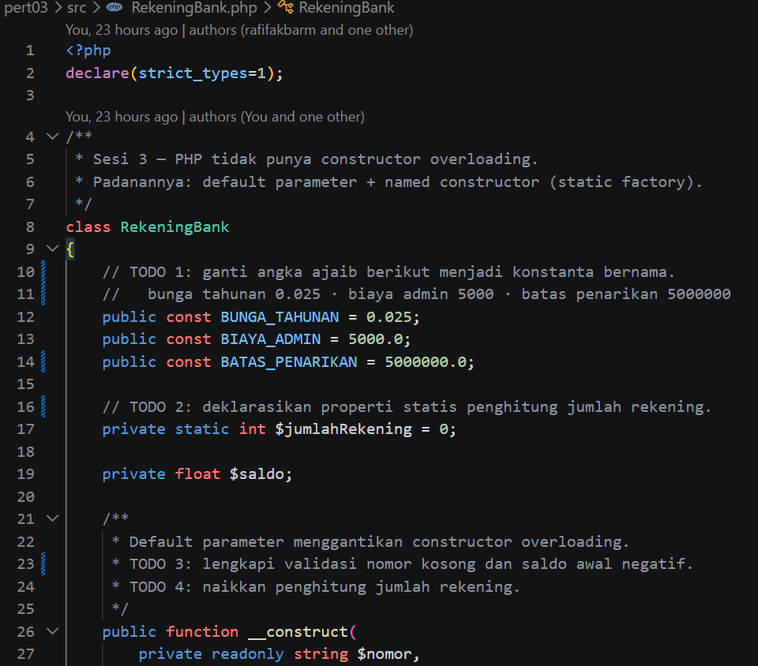
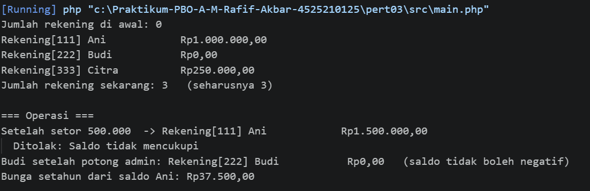

# LAPORAN PRAKTIKUM PEMROGRAMAN BERBASIS OBJEK

| Informasi Praktikan | Keterangan |
| :--- | :--- |
| **Nama** | Muhammad Rafif Akbar |
| **NPM** | 4525210125 |
| **Kelas** | A |
| **Mata Kuliah** | Pemrograman Berbasis Objek (PBO) |
| **Pertemuan** | 03 - Constructor, Anggota Statis, dan Konstanta |
| **Tanggal** | Kamis 17 September 2026 |

---

## 1. Implementasi Java

### 1.1. File: `Main.java`

**Penjelasan Kode:**
> Menguji pembuatan rekening dengan konstruktor lengkap, jumlah rekening, operasi setor dan tarik, biaya administrasi, serta perhitungan bunga tahunan.

**Bukti Eksekusi (Screenshot):**
- **Before** 
- **After** 

### 1.2. File: `RekeningBank.java`

**Penjelasan Kode:**
> Merepresentasikan rekening bank. Nomor rekening dan pemilik ditetapkan saat objek dibuat, saldo dijaga agar tidak negatif, dan operasi transaksi divalidasi. Konstanta menyimpan bunga tahunan, biaya administrasi, batas penarikan, dan menghitung jumlah rekening.

**Bukti Eksekusi (Screenshot):**
- **Before** 
- **After** 

### Output

**Output Program:**

---

## 2. Implementasi PHP

### 2.1. File: `main.php`

**Penjelasan Kode:**
> Menjalankan alur rekening bank di PHP, termasuk rekening pelajar, transaksi, penanganan pengecualian, dan format bunga.

**Bukti Eksekusi (Screenshot):**
- **Before** 
- **After** 

### 2.2. File: `RekeningBank.php`

**Penjelasan Kode:**
> Implementasi rekening bank PHP dengan konstruktor, anggota static, konstanta, validasi saldo dan transaksi, serta method untuk setor, tarik, biaya administrasi, dan bunga.

**Bukti Eksekusi (Screenshot):**
- **Before** 
- **After** 

### Output

**Output Program:**

---

## 3. Kesimpulan

Constructor menginisialisasi objek dan constructor delegation menghindari duplikasi validasi. Anggota static dimiliki bersama oleh kelas, sedangkan konstanta memberi nama pada nilai tetap agar kode lebih mudah dirawat.