# LAPORAN PRAKTIKUM PEMROGRAMAN BERBASIS OBJEK

| Informasi Praktikan | Keterangan |
| :--- | :--- |
| **Nama** | Muhammad Rafif Akbar |
| **NPM** | 4525210125 |
| **Kelas** | A |
| **Mata Kuliah** | Pemrograman Berbasis Objek (PBO) |
| **Pertemuan** | 04 - Inheritance (Pewarisan) |
| **Tanggal** | Kamis 24 September 2026 |

---

## 1. Implementasi Java

### 1.1. File: `Main.java`

**Penjelasan Kode:**
> Membuat objek pegawai dan memperlihatkan penggunaan kelas induk serta kelas turunan untuk membedakan perhitungan atau informasi pegawai.

**Bukti Eksekusi (Screenshot):**
- **Before** 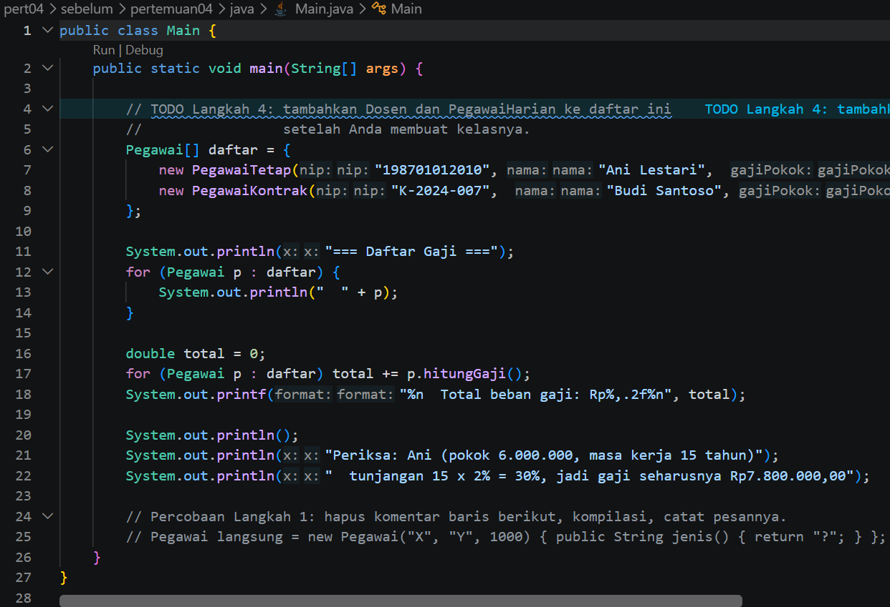
- **After** 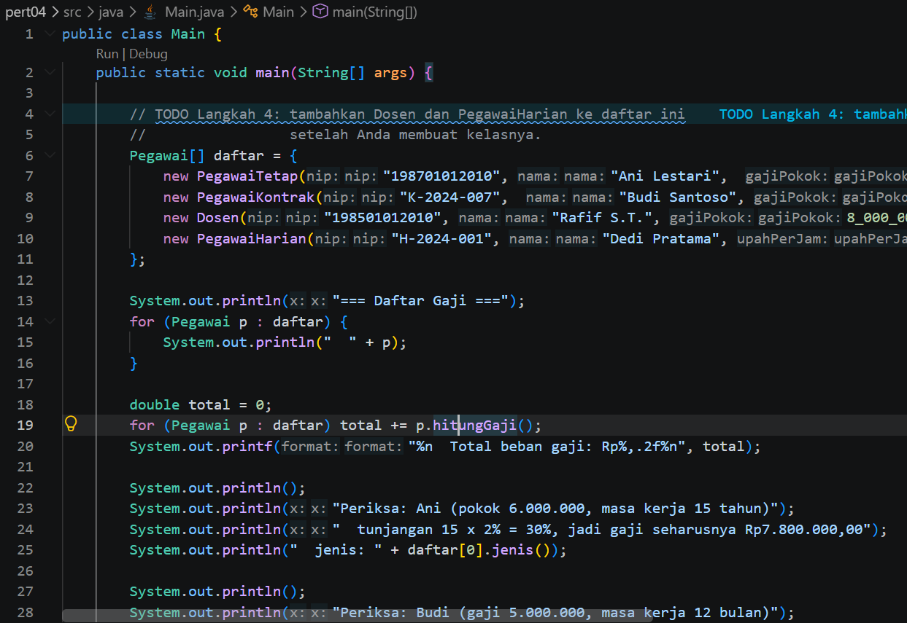

### 1.2. File: `Pegawai.java`

**Penjelasan Kode:**
> Kelas yang menyimpan data umum pegawai dan perilaku dasar yang dapat digunakan oleh kelas turunan.

**Bukti Eksekusi (Screenshot):**
- **Before** 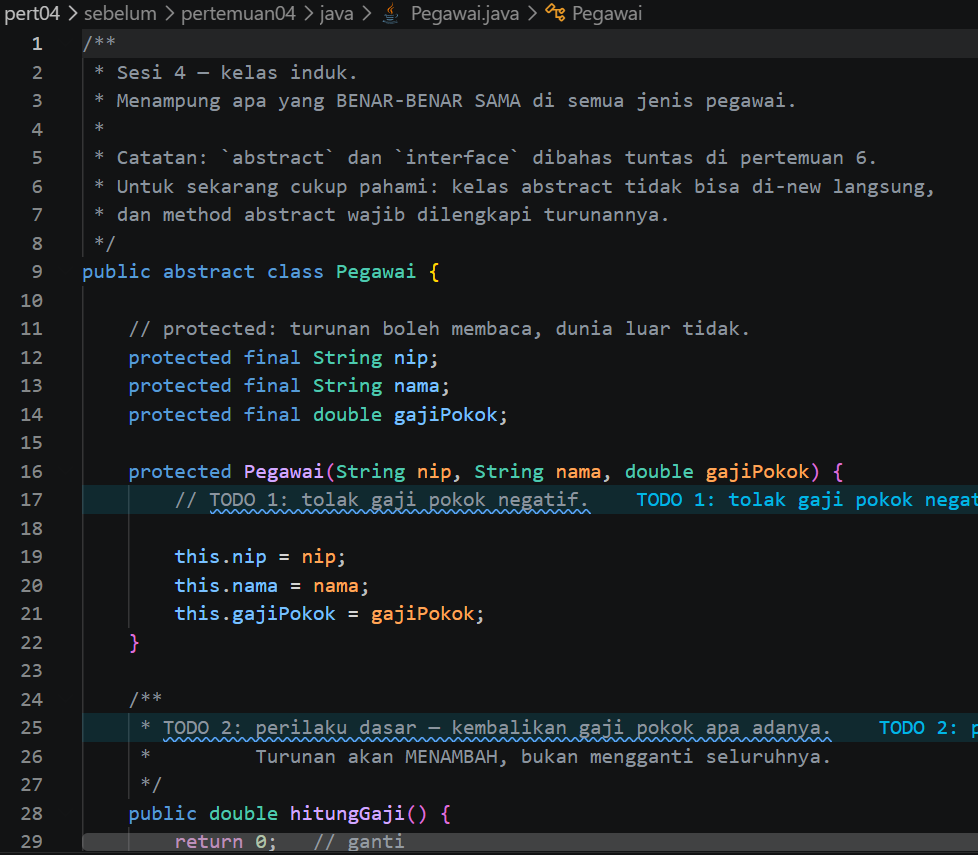
- **After** 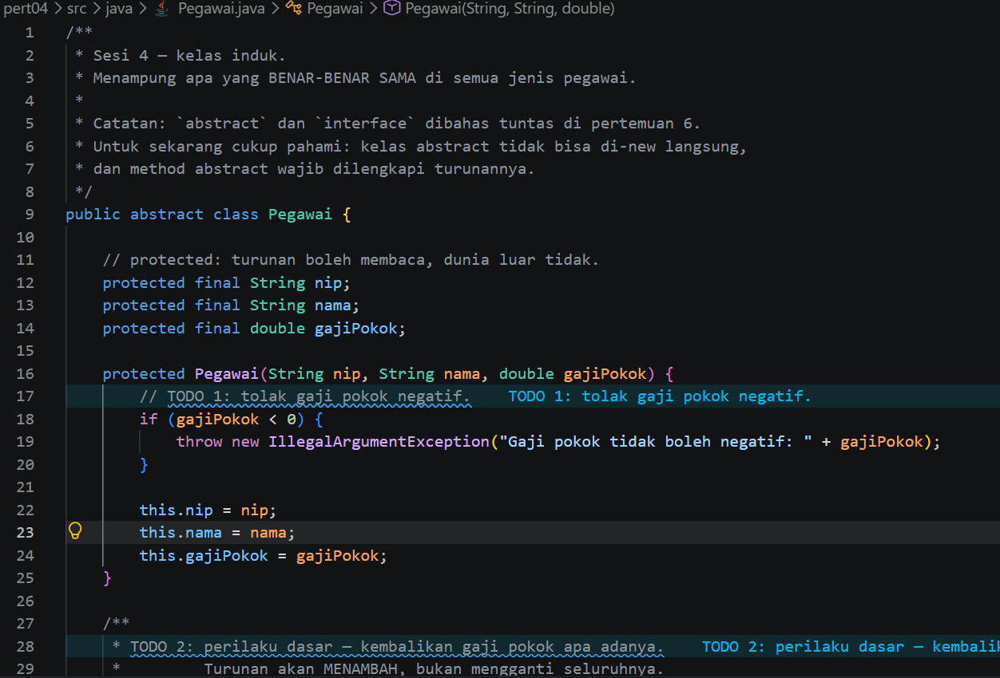

### 1.3. File: `PegawaiKontrak.java`

**Penjelasan Kode:**
> Kelas turunan yang merepresentasikan pegawai kontrak dan menambahkan perilaku khusus sesuai status kontrak.

**Bukti Eksekusi (Screenshot):**
- **Before** 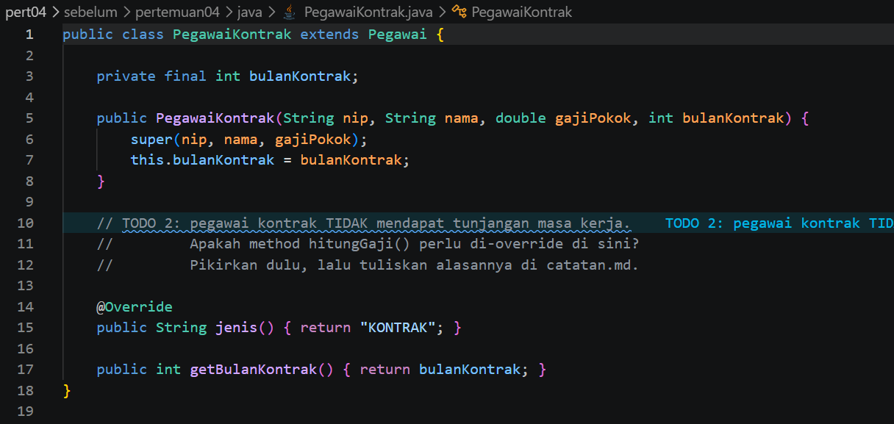
- **After** 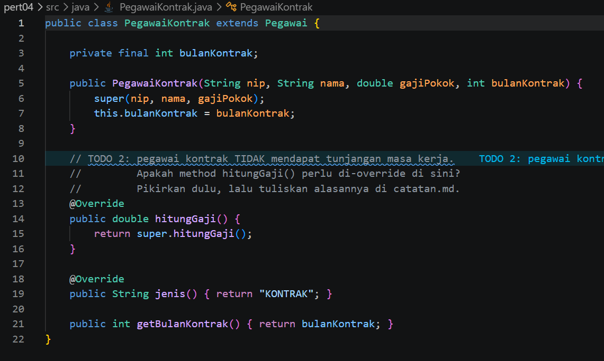

### 1.4. File: `PegawaiTetap.java`

**Penjelasan Kode:**
> Kelas turunan yang merepresentasikan pegawai tetap dan menerapkan perilaku khusus pegawai tetap.

**Bukti Eksekusi (Screenshot):**
- **Before** 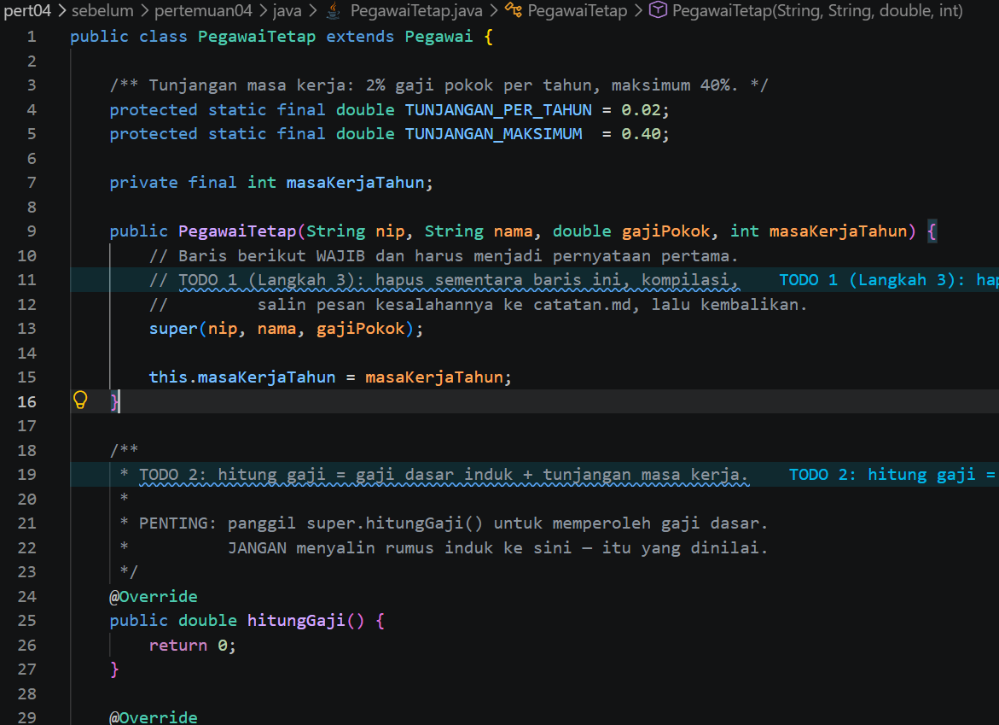
- **After** 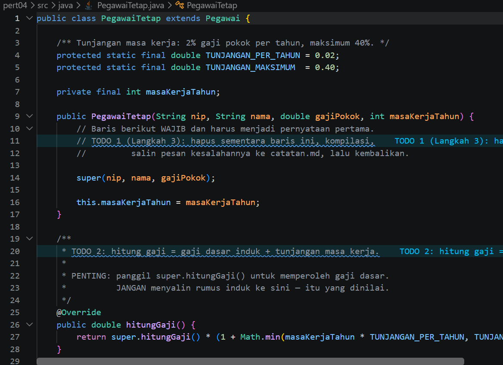

### Output

**Output Program:**

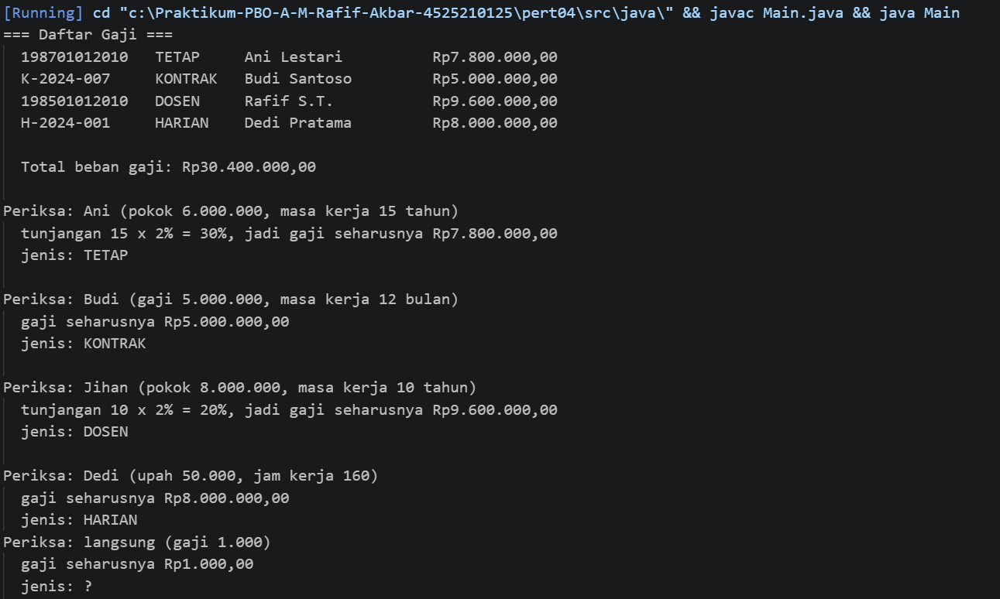

---

## 2. Implementasi PHP

### 2.1. File: `main.php`

**Penjelasan Kode:**
> Program PHP untuk membuat dan menggunakan objek pegawai melalui kelas dasar dan turunannya.

**Bukti Eksekusi (Screenshot):**
- **Before** 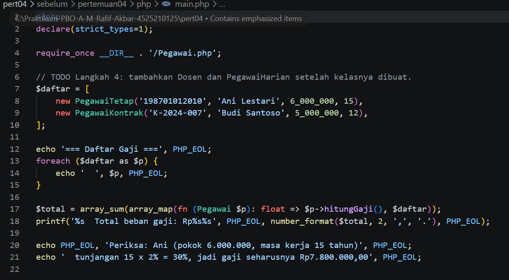
- **After** 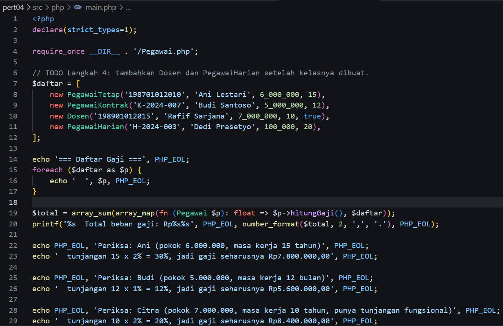

### 2.2. File: `Pegawai.php`

**Penjelasan Kode:**
> Kelas dasar pegawai dalam PHP yang menyediakan data dan perilaku umum untuk kelas turunan.

**Bukti Eksekusi (Screenshot):**
- **Before** 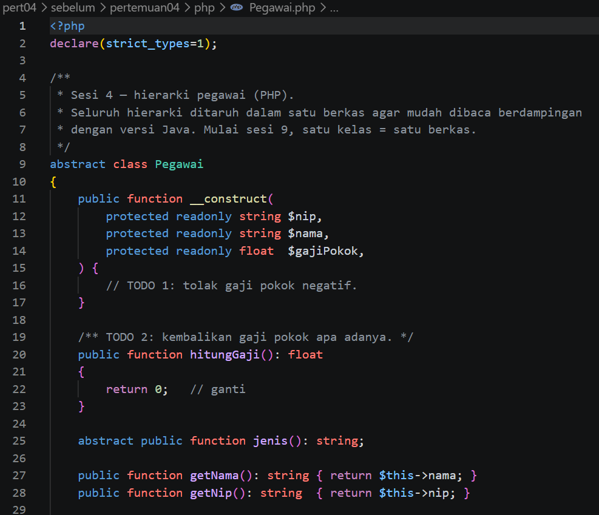
- **After** 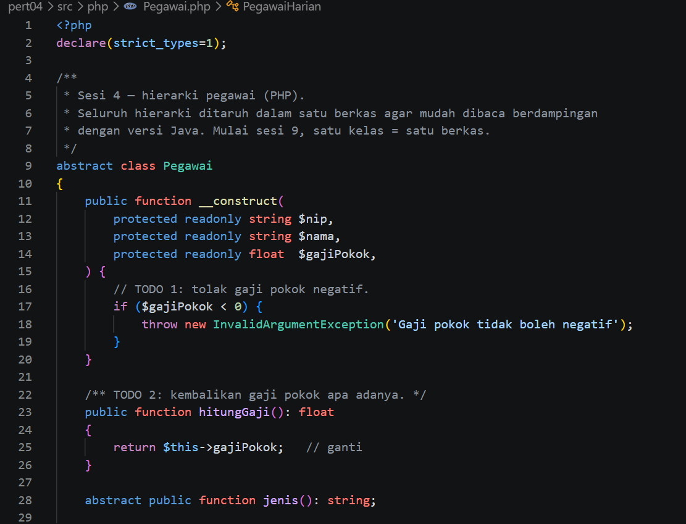

### Output

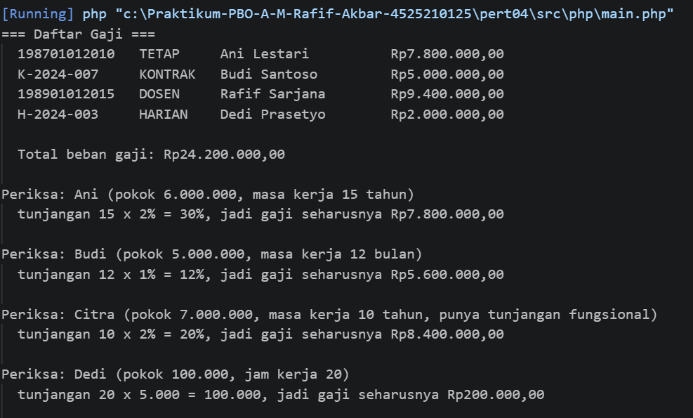

---

## 3. Kesimpulan

Inheritance memungkinkan kelas turunan menggunakan dan mengembangkan atribut maupun method kelas induk. Dengan pemodelan pegawai tetap dan kontrak, bagian yang sama bisa ditempatkan pada kelas induk, dan perilaku khusus diletakkan di kelas turunan.