# LAPORAN PRAKTIKUM PEMROGRAMAN BERBASIS OBJEK

| Informasi Praktikan | Keterangan |
| :--- | :--- |
| **Nama** | Muhammad Rafif Akbar |
| **NPM** | 4525210125 |
| **Kelas** | A |
| **Mata Kuliah** | Pemrograman Berbasis Objek (PBO) |
| **Pertemuan** | 05 - Polimorfisme |
| **Tanggal** | Kamis 1 Oktober 2026 |

---

## 1. Implementasi Java

### 1.1. File: `Main.java`

**Penjelasan Kode:**
> Menguji objek bangun datar melalui tipe induk sehingga method yang dipanggil menyesuaikan kelas objek sebenarnya.

**Bukti Eksekusi (Screenshot):**
- **Before** 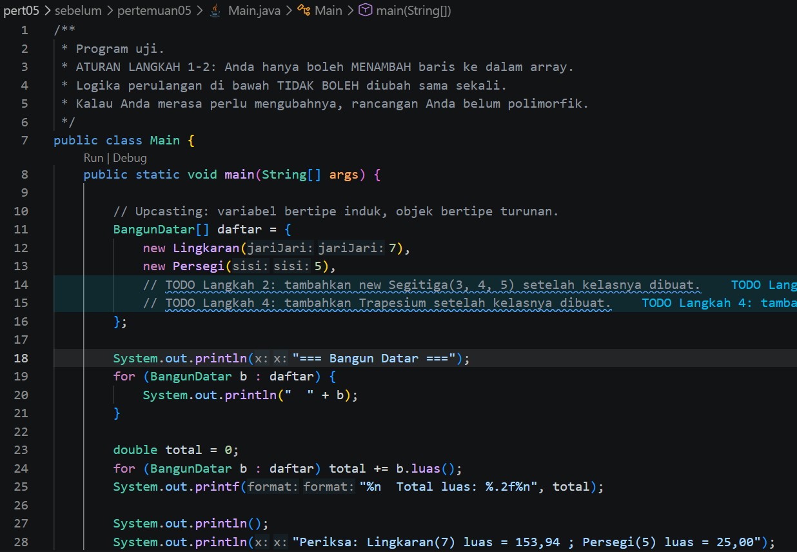
- **After** 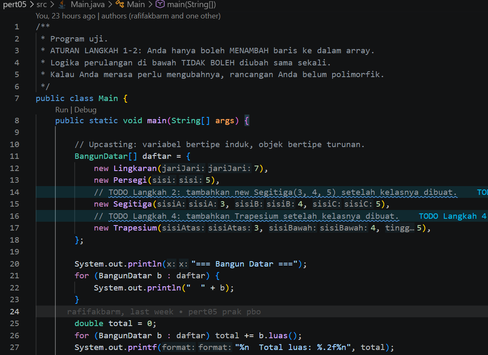

### 1.2. File: `AntiPattern.java`

**Penjelasan Kode:**
> Contoh pola desain yang kurang untuk dibandingkan dengan pendekatan polimorfisme biasany membutuhkan pemeriksaan tipe untuk setiap bentuk.

**Bukti Eksekusi (Screenshot):**
- **Before** 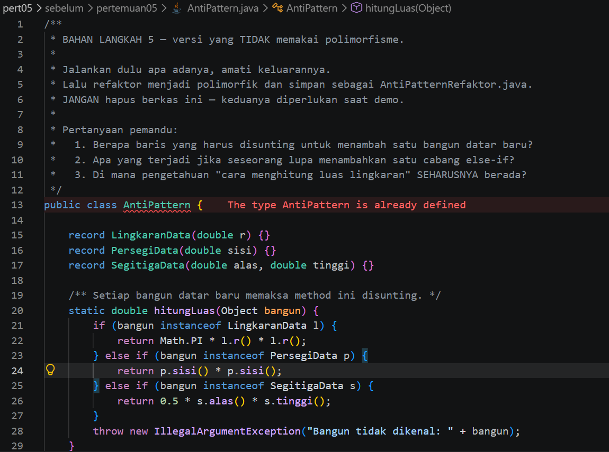
- **After** 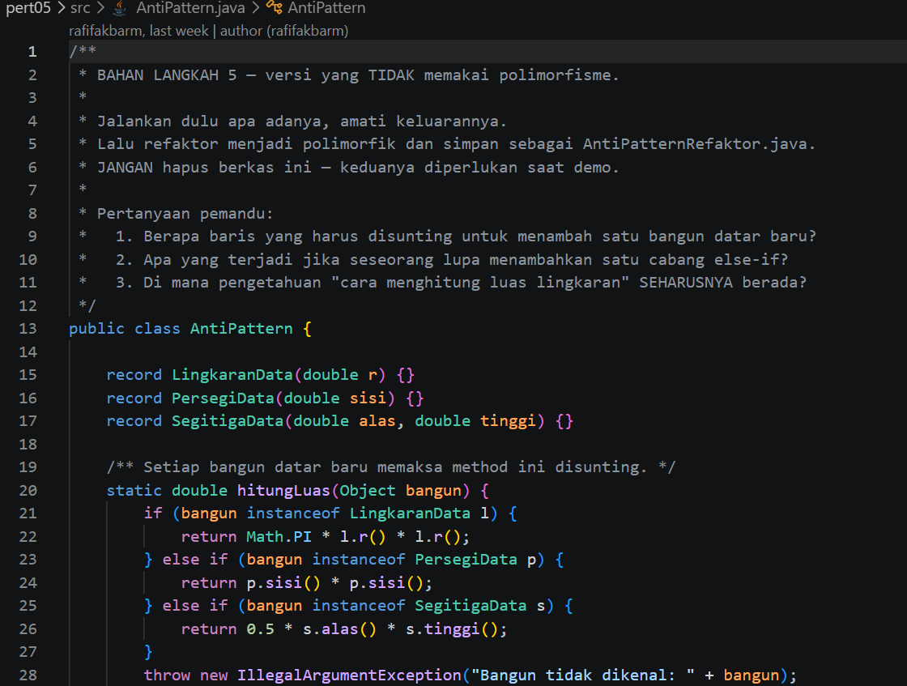

### 1.3. File: `BangunDatar.java`

**Penjelasan Kode:**
> Kelas abstraksi bangun datar yang mendefinisikan perilaku umum, seperti menghitung luas, untuk diimplementasikan kelas turunan.

**Bukti Eksekusi (Screenshot):**
- **Before** (kondisi awal/kesalahan, jika ada): `screenshots/before-BangunDatar.png`
- **After** (kondisi akhir): `screenshots/after-BangunDatar.png`

### 1.4. File: `Lingkaran.java`

**Penjelasan Kode:**
> Kelas bangun datar berbentuk lingkaran yang menghitung luas berdasarkan jari jari.

**Bukti Eksekusi (Screenshot):**
- **Before** 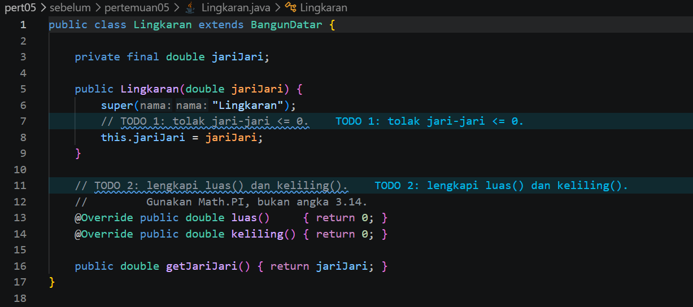
- **After** 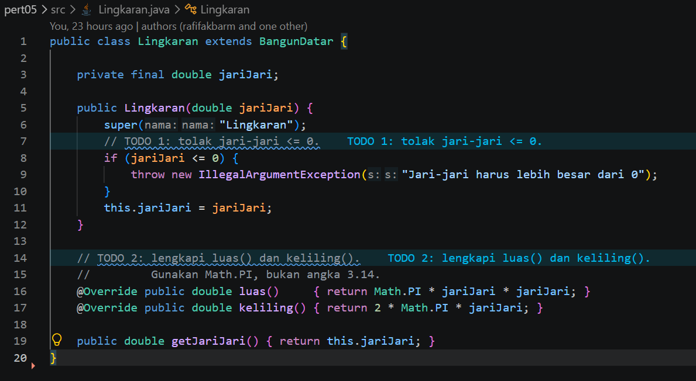

### 1.5. File: `Persegi.java`

**Penjelasan Kode:**
> Kelas bangun datar berbentuk persegi yang menghitung luas berdasarkan panjang sisi.

**Bukti Eksekusi (Screenshot):**
- **Before** 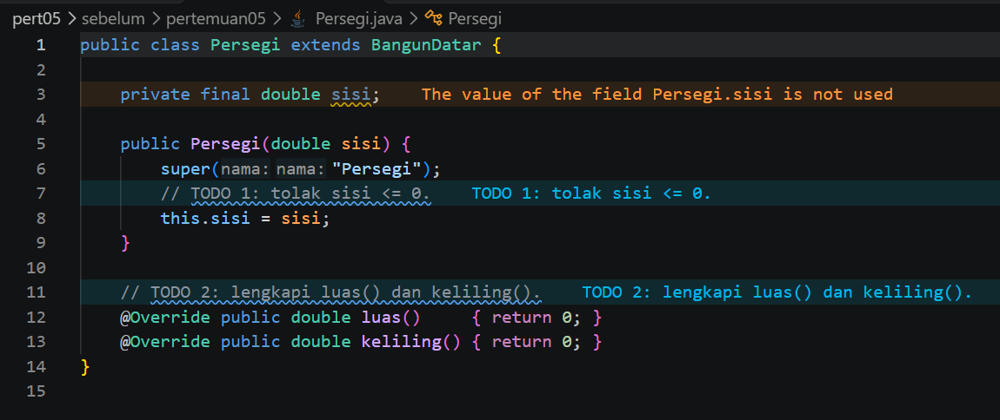
- **After** 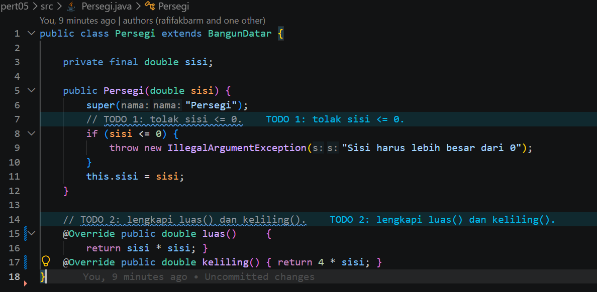

### Output

**Output Program:**

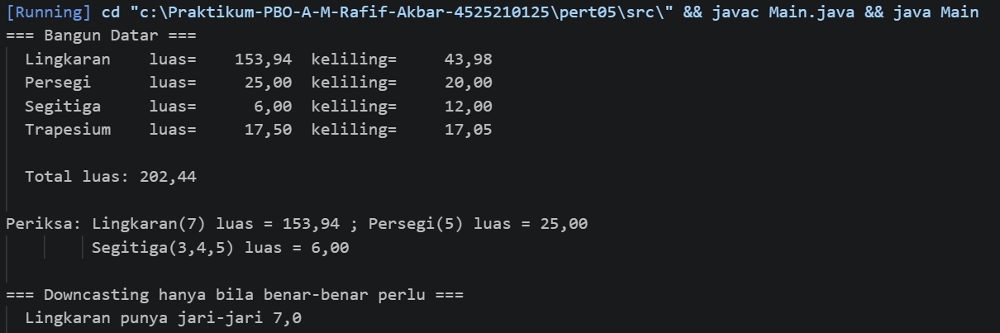

---

## 2. Implementasi PHP

### 2.1. File: `main.php`

**Penjelasan Kode:**
> Program PHP yang menguji implementasi polimorfisme bangun datar dan menampilkan hasil pemanggilan perilaku objek.

**Bukti Eksekusi (Screenshot):**
- **Before** 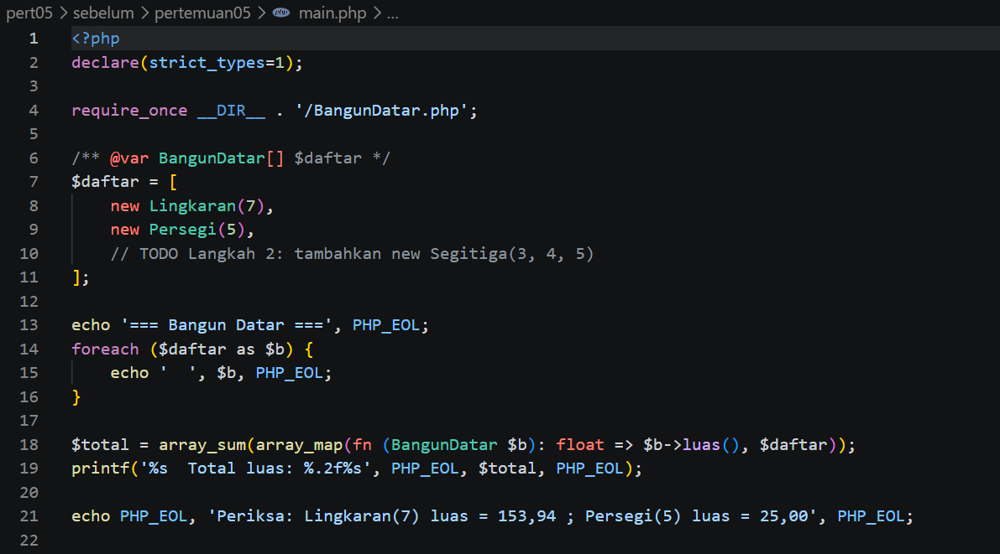
- **After** 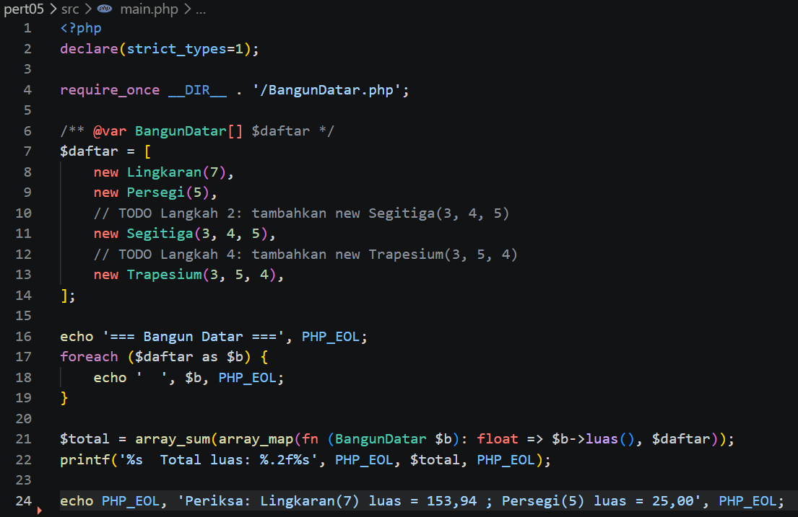

### 2.2. File: `BangunDatar.php`

**Penjelasan Kode:**
> Abstraksi bangun datar di PHP untuk menyamakan perilaku kelas bentuk yang berbeda.

**Bukti Eksekusi (Screenshot):**
- **Before** 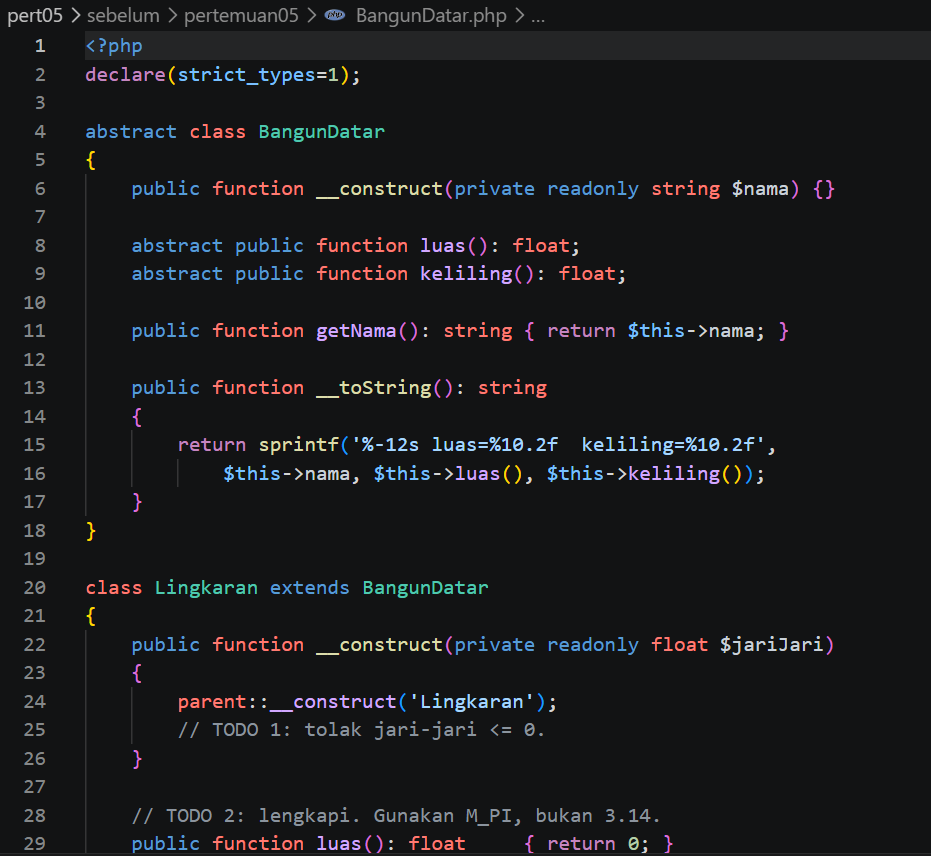
- **After** 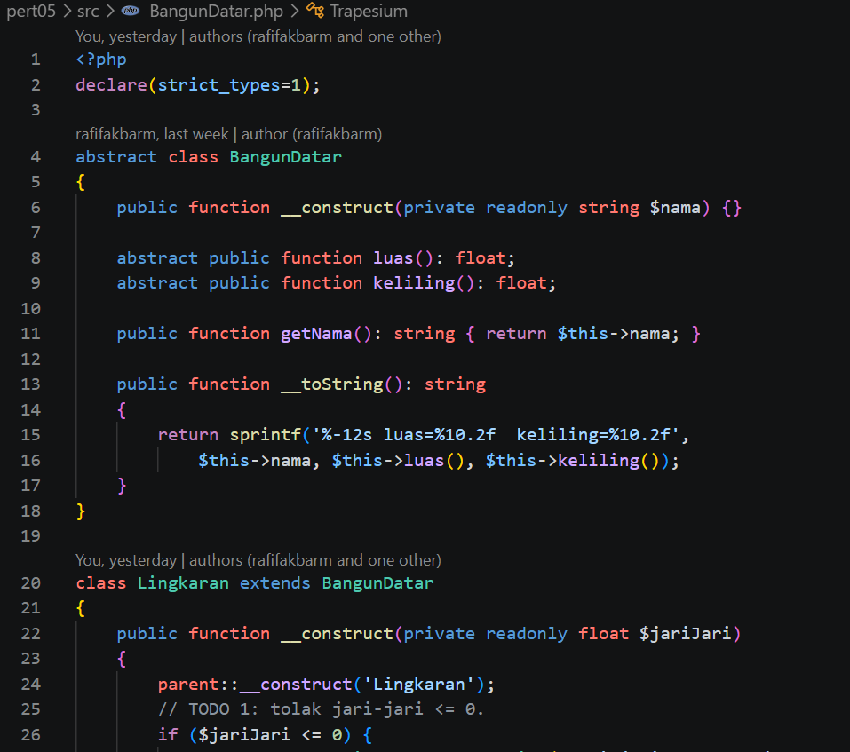

### 2.3. File: `notifikasi.php`

**Penjelasan Kode:**
> Contoh tambahan pemanfaatan perilaku polimorfik pada notifikasi, sehingga pemanggil menggunakan perilaku umum tanpa bergantung pada detail implementasi.

**Bukti Eksekusi (Screenshot):**
- **Before** 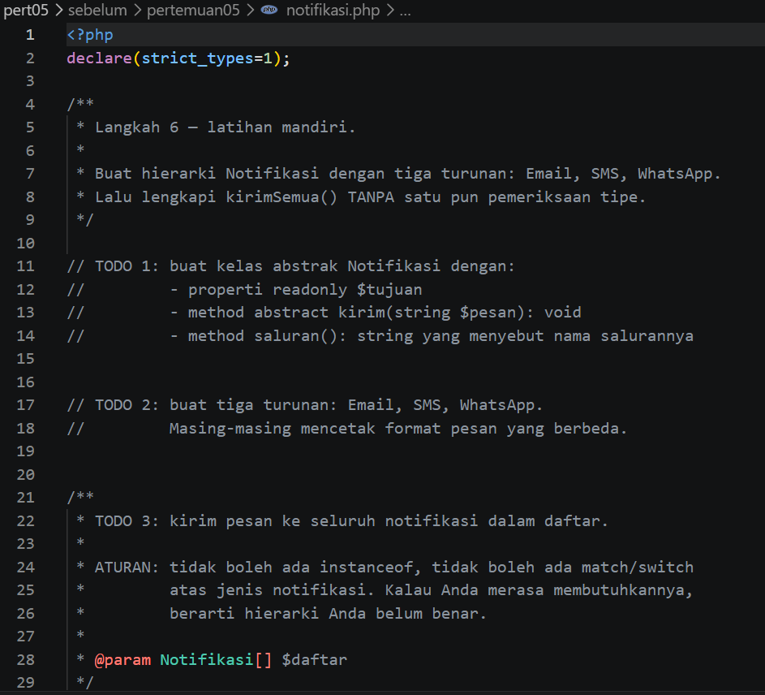
- **After** 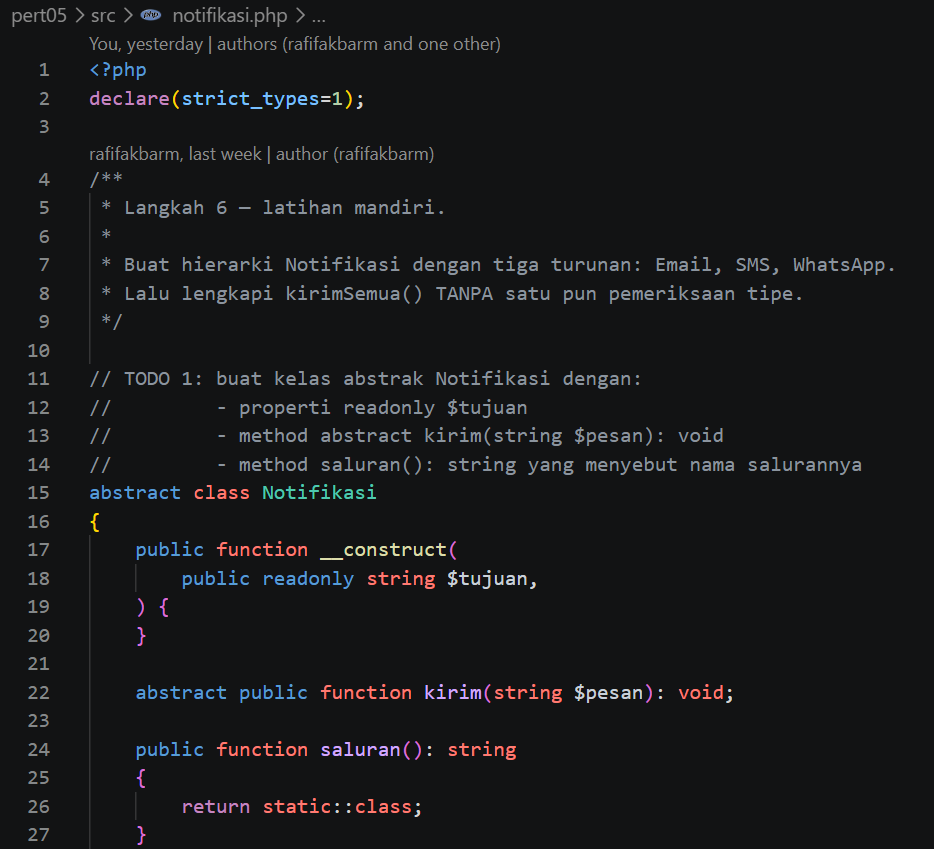

### Output

**Output Program:**

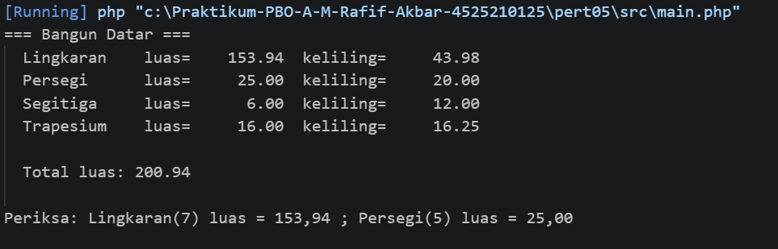

---

## 3. Kesimpulan

Polimorfisme memungkinkan objek dari kelas berbeda diperlakukan melalui tipe atau kontrak yang sama, tetapi menjalankan implementasi method masing-masing. Pendekatan ini mengurangi percabangan berdasarkan tipe dan memudahkan penambahan kelas baru.